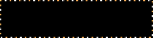

# RackTicker plugin starter

**A whole RackTicker screen, in about forty lines. Fork it and make it yours.**



This is a working [RackTicker](https://github.com/costamesatechsolutions/rackticker)
plugin: a marquee sign whose phrases fly in with a different LED effect every time,
inside a border of chasing bulbs. It is the shortest complete example of everything a
plugin can do — settings the control page draws for you, validation, a migration for
when your settings change shape, and an animation that holds the playlist until it has
finished saying its piece.

## Install it on a RackTicker

Open the control page, go to **Plugins**, and paste this repository's link:

```
https://github.com/costamesatechsolutions/rackticker-plugin-starter
```

It installs into its own sandboxed process. If your plugin misbehaves, only your
plugin restarts — the panel keeps running.

## Make it your own

1. **Use this template** (or fork), and clone your copy.
2. Rename `rackticker_hello.py`, and change the `id`, `name` and `description` in
   `plugin.json` and the names in `pyproject.toml`.
3. Draw whatever you like in `render`.

With a clone of RackTicker beside it you get the emulator and the checker:

```sh
python -m app.dev preview ../rackticker-plugin-starter   # live, in your browser
python -m app.dev check ../rackticker-plugin-starter     # timings, and preview.png
python -m app.dev push ../rackticker-plugin-starter --to rackticker.local:8081
```

`check` is the one that matters before you publish: it renders your screen on live
data, times it, and tells you if any letters are clipped. The panel is 128×32 and the
Pi is about six times slower than your laptop, so keep a frame well under 10 ms.

## The rules of a good screen

- **Legible from across the room.** 2× text for the headline, 5×7 for details, the
  tiny font only for labels. Nothing cut off mid-word: make it fit, or page it.
- **Saturated colours.** Pinks and pastels disappear on an LED panel.
- **No I/O while drawing.** `render` is called on the display loop. Fetch in a
  provider; draw from what you already have.
- **Take your time from `context.animation_time`**, never from the wall clock.

The full reference is [docs/plugins.md](https://github.com/costamesatechsolutions/rackticker/blob/main/docs/plugins.md),
and `python -m app.dev new my_plugin` writes a fresh skeleton with notes for AI
coding agents in it.

## Licence

AGPL-3.0-only, the same as RackTicker itself. Your own plugin can be whatever you like
as long as it respects the licence of anything it borrows.

Built by [Costa Mesa Tech Solutions](https://github.com/costamesatechsolutions).
